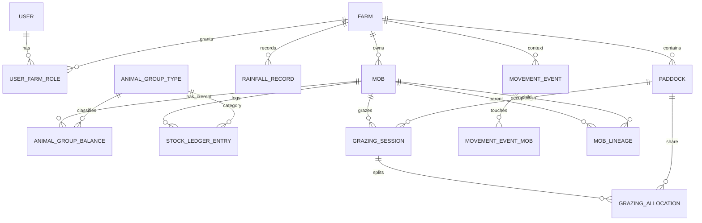

# AgriTrack Flask App Plan

## 1) Product scope (MVP -> scalable)

Build a Flask web app for multi-farm livestock and grazing management with:

- Multi-farm support (`User -> Farm` access).
- Stock accounting at multiple levels:
  - Animal Group (type/breed/gender class + count)
  - Mob (collection of animal groups)
  - Paddock/Camp (where mobs graze)
  - Farm (roll-up across paddocks)
  - Portfolio (roll-up across farms)
- Full movement traceability over time:
  - Mob moves between paddocks.
  - Mob can graze multiple paddocks simultaneously (split allocation).
  - Mob split and merge operations.
- Paddock utilization and rest history.
- Rainfall tracking and reporting per farm.

## 2) Recommended project structure

```text
agritrack/
├── app/
│   ├── __init__.py                 # app factory, extension init, blueprint registration
│   ├── config.py                   # environment-based config classes
│   ├── extensions.py               # db, migrate, login manager, etc.
│   │
│   ├── models/
│   │   ├── __init__.py
│   │   ├── base.py                 # Base mixins: timestamps, soft delete, UUID helpers
│   │   ├── user.py
│   │   ├── farm.py
│   │   ├── paddock.py
│   │   ├── mob.py
│   │   ├── animal_group.py
│   │   ├── stock_ledger.py         # in/out/adjustment events
│   │   ├── grazing.py              # occupancy sessions + allocation fractions
│   │   ├── movement.py             # move/split/merge event records
│   │   ├── rainfall.py
│   │   └── snapshot.py             # denormalized daily balances (optional optimization)
│   │
│   ├── services/                   # business logic (fat service, thin route)
│   │   ├── stock_service.py        # all count updates through ledger rules
│   │   ├── movement_service.py     # move, split, merge orchestration
│   │   ├── grazing_service.py      # occupancy lifecycle, rest calculations
│   │   ├── reporting_service.py    # farm/paddock/mob rollups
│   │   └── validation_service.py
│   │
│   ├── repositories/               # query encapsulation and reusable filters
│   │   ├── mob_repo.py
│   │   ├── paddock_repo.py
│   │   └── stock_repo.py
│   │
│   ├── blueprints/
│   │   ├── auth/
│   │   │   ├── routes.py
│   │   │   ├── forms.py
│   │   │   └── templates/
│   │   ├── farms/
│   │   ├── paddocks/
│   │   ├── mobs/
│   │   ├── stock/
│   │   ├── grazing/
│   │   └── reports/
│   │
│   ├── templates/
│   ├── static/
│   ├── api/                        # optional REST/JSON API
│   │   ├── v1/
│   │   │   ├── schemas.py          # Marshmallow/Pydantic schemas
│   │   │   └── routes.py
│   └── cli.py                      # flask CLI custom commands (seed, snapshots)
│
├── migrations/                     # Alembic migrations
├── tests/
│   ├── conftest.py
│   ├── unit/
│   ├── integration/
│   └── api/
├── docs/
│   ├── flask_app_plan.md
│   ├── erd.md
│   └── event_lifecycle.md
├── scripts/
│   ├── seed_demo_data.py
│   └── backfill_snapshots.py
├── requirements/
│   ├── base.txt
│   ├── dev.txt
│   └── prod.txt
├── .env.example
├── wsgi.py
├── manage.py
└── README.md
```

## 3) Domain model (core entities and relationships)

### Key relationships

- `farm -> paddock`: **one-to-many**
- `farm -> rainfall_record`: **one-to-many**
- `mob <-> paddock`: **many-to-many over time** via `grazing_session` + `grazing_allocation`
- `mob -> animal_group_balance`: **one-to-many current balances**
- `mob -> stock_ledger_entry`: **one-to-many immutable events**
- `mob movement traceability`: via immutable `movement_event` records

### Why event + balance model

Use two layers for stock counts:

1. **Immutable ledgers/events** (source of truth):
   - Stock in/out/adjustments
   - Movement (transfer/split/merge)
   - Grazing occupancy start/end
2. **Current balance tables** (fast reads):
   - Current animal group counts per mob
   - Optional daily snapshots per paddock/farm

This gives auditability + performance.

## 4) Database diagram (Mermaid ERD)



## 5) Suggested table design (initial)

### `farm`
- `id (uuid pk)`
- `name`
- `timezone`
- `active`
- `created_at`, `updated_at`

### `paddock`
- `id`
- `farm_id (fk farm)`
- `name`
- `area_ha`
- `grazeable_area_ha`
- `status` (active/inactive)
- `created_at`, `updated_at`

### `mob`
- `id`
- `farm_id`
- `name`
- `status` (active/archived)
- `origin_note` (optional)
- `created_at`, `updated_at`

### `animal_group_type`
Reference taxonomy for grouping logic.
- `id`
- `species` (cattle/sheep/goat/etc.)
- `breed`
- `sex` (male/female/mixed)
- `age_class` (lamb, weaner, heifer, etc.)
- `unique (species, breed, sex, age_class)`

### `animal_group_balance`
Current on-hand counts per mob.
- `id`
- `mob_id`
- `animal_group_type_id`
- `head_count` (>= 0)
- `effective_from` (last recalculated time)
- `unique (mob_id, animal_group_type_id)`

### `stock_ledger_entry`
Immutable stock accounting events.
- `id`
- `farm_id`
- `mob_id`
- `animal_group_type_id`
- `event_time`
- `event_type` enum:
  - `birth`, `purchase`, `transfer_in`, `adjustment_in`
  - `death`, `sale`, `missing`, `transfer_out`, `adjustment_out`
- `quantity` (positive integer)
- `unit_cost` (optional)
- `counterparty`
- `reference` (invoice/tag batch etc.)
- `note`
- `created_by`

> Rule: never edit/delete ledger rows; use reversal/correction entry.

### `grazing_session`
Represents a contiguous time interval where a mob is grazing one or more paddocks.
- `id`
- `farm_id`
- `mob_id`
- `start_at`
- `end_at` (nullable while open)
- `reason` (rotation, storm, break fence, etc.)

### `grazing_allocation`
Per-session split across paddocks (supports simultaneous grazing).
- `id`
- `grazing_session_id`
- `paddock_id`
- `allocation_fraction` decimal(5,4) (e.g., 0.5 + 0.5)
- `unique (grazing_session_id, paddock_id)`

> Rule: sum of `allocation_fraction` for one session must equal `1.0`.

### `movement_event`
High-level movement actions for traceability.
- `id`
- `farm_id`
- `event_time`
- `event_kind` enum: `move`, `split`, `merge`
- `source_note`
- `created_by`

### `movement_event_mob`
Links movement event to one or more mobs with role semantics.
- `id`
- `movement_event_id`
- `mob_id`
- `role` enum: `source`, `target`, `result`

### `mob_lineage`
Explicit lineage for split/merge ancestry graph.
- `id`
- `parent_mob_id`
- `child_mob_id`
- `movement_event_id`
- `ratio` (optional percentage inheritance)

### `rainfall_record`
- `id`
- `farm_id`
- `recorded_on` (date)
- `mm`
- `source` (manual/station/import)
- `note`

## 6) CRUD + workflow design for your goals

### Animal groups in mob (CRUD)
- Create/update/delete handled as **ledger-backed operations**.
- UI allows direct editing counts, backend converts deltas into `stock_ledger_entry` adjustments.
- Recompute `animal_group_balance` after every ledger write in same transaction.

### View stock per paddock/farm
- **Mob-level** = sum of current `animal_group_balance`.
- **Paddock-level now** = sum mobs currently grazing paddock weighted by allocation.
- **Farm-level now** = sum all active mobs.

### Movement traceability across time
- Every move/split/merge writes:
  - `movement_event`
  - affected `grazing_session` close/open
  - optional lineage edges (`mob_lineage`)
- Timeline view can query by mob, paddock, or farm date range.

### Grazing/rest history per paddock
- Build from `grazing_session` + `grazing_allocation` intervals.
- Rest period = gap between occupancy intervals.
- Utilization metrics:
  - total occupied days
  - rest days
  - occupancy intensity (weighted by allocation)

### Animals in/out categories
Mapped to `stock_ledger_entry.event_type`:
- In: birth, purchase, transfer_in, adjustment_in
- Out: missing, death, sale, transfer_out, adjustment_out

### Merge/split operations
- **Split**: one source mob -> two+ result mobs, with explicit quantity transfers by animal group.
- **Merge**: two+ source mobs -> one result mob.
- Keep source mobs archived (or active with zero stock per business choice), never delete.

## 7) Service layer transaction patterns

### `move_mob(mob_id, to_paddocks[], fractions[], when)`
1. Close active grazing session for mob at `when`.
2. Create new `grazing_session` starting `when`.
3. Insert `grazing_allocation` rows with fractions (must sum 1).
4. Record `movement_event(kind='move')`.

### `split_mob(source_mob_id, splits[], when)`
- `splits` define new mobs + group counts assigned.
1. Validate requested counts <= source balances.
2. Create result mobs.
3. Generate paired ledger entries:
   - `transfer_out` from source
   - `transfer_in` to each result
4. Create `movement_event(kind='split')` and lineage rows.
5. Optionally inherit grazing session or force placement flow.

### `merge_mobs(source_mob_ids, result_mob_name, when)`
1. Create result mob.
2. Transfer all balances out of sources into result via ledger.
3. Record `movement_event(kind='merge')` + lineage.
4. Archive or zero out sources according to policy.

## 8) API and UI endpoints (MVP)

### Core pages
- Dashboard: farm summary stock + paddock occupancy + rainfall sparkline.
- Farms list/detail.
- Paddocks list/detail (current stock, grazing history, rest periods).
- Mobs list/detail (animal groups, timeline, current paddock allocation).

### Suggested endpoints
- `GET/POST /farms`
- `GET/PATCH /farms/<id>`
- `GET/POST /farms/<id>/paddocks`
- `GET/PATCH /paddocks/<id>`
- `GET /paddocks/<id>/history`
- `GET/POST /farms/<id>/mobs`
- `GET/PATCH /mobs/<id>`
- `POST /mobs/<id>/animal-groups/adjust`
- `POST /mobs/<id>/move`
- `POST /mobs/<id>/split`
- `POST /mobs/merge`
- `GET /mobs/<id>/timeline`
- `GET/POST /farms/<id>/rainfall`

## 9) Non-functional design for scalability

- Use UUIDs for distributed-safe identifiers.
- Add indexes:
  - `stock_ledger_entry (mob_id, event_time)`
  - `grazing_session (mob_id, start_at, end_at)`
  - `grazing_allocation (paddock_id)`
  - `movement_event (farm_id, event_time)`
- Keep writes append-only where possible.
- Introduce daily snapshot tables once data grows.
- Add optimistic locking/version columns for concurrent edits.
- Soft-delete only for metadata (farm/paddock/mob), never for ledger.

## 10) Suggested phased implementation plan

### Phase 1 (MVP foundations)
- App factory, auth, farm/paddock/mob CRUD.
- Animal group balances + ledger model.
- Basic move between paddocks (single paddock first).
- Farm/paddock/mob stock views.

### Phase 2 (traceability + grazing depth)
- Grazing sessions with multi-paddock allocation.
- Movement events + timeline pages.
- Paddock utilization + rest calculations.

### Phase 3 (advanced stock ops)
- Split/merge workflows.
- Validation/audit logs and correction entries.
- Snapshot/report performance optimizations.

### Phase 4 (integration + ops)
- Rainfall import integration.
- API hardening + role-based access.
- Background jobs for nightly summary builds.

## 11) Initial migration order

1. users, farms, user_farm_roles
2. paddocks, rainfall_records
3. mobs, animal_group_types
4. stock_ledger_entries, animal_group_balances
5. grazing_sessions, grazing_allocations
6. movement_events, movement_event_mobs, mob_lineage
7. optional snapshots/report tables

## 12) Guardrails and invariants

- Ledger quantity must be > 0.
- Balance per mob+group must never go negative.
- Exactly one open grazing session per mob at a time.
- Allocation fractions per grazing session must sum to 1.0.
- Split/merge must preserve total headcount across participating mobs.
- Every movement/split/merge must have an immutable event record.

